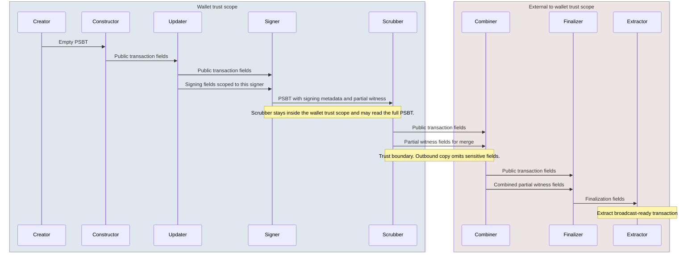
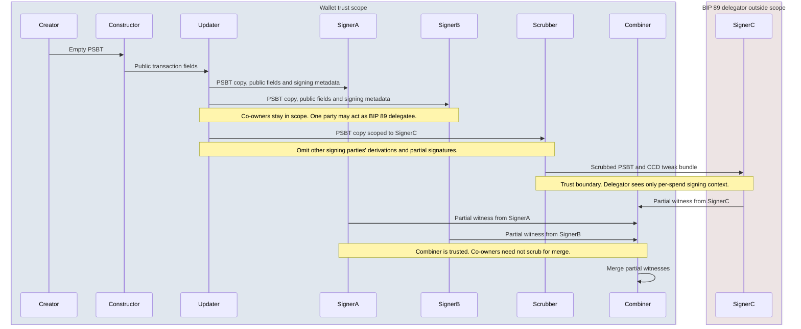

# BIP: XXX Privacy PSBT

## Abstract

PSBT creation, construction, updating, and signing may all add privacy-sensitive information to PSBTs.

When exchanging (modifiable) PSBTs during construction (BIP 370 or otherwise) or signing with untrusted counterparties, only some fields are necessary to share, and privacy can be harmed significantly if certain fields required for a signing device, for example, are leaked to an untrusted party.

This document specifies what fields can be shared with trusted and untrusted parties such that privacy is preserved.

## Rationale

Historically, PSBTs were exchanged only with trusted peers. For example, one owner, one organization, or mutually trusting cosigners. Interactive protocols now pass PSBTs across trust boundaries (payjoin, coordinator-less coinjoin, external combiners). Some protocols, such as BIP 77, explicitly mention what fields should be removed. However, other interactive transaction-construction BIPs either always assume a trusted environment or tacitly assume that clients will remove sensitive information. Without proper specification clients will diverge.

## Trust scope

Model the trust scope as a single authorization boundary: every PSBT role inside it may observe the full PSBT, including signing material and wallet-internal metadata. You rely on those parties not to relay that data outside the scope. When a PSBT leaves the scope, hand off only the entries the external role needs for its next step. Scrub every privacy-sensitive field listed below at each trust-boundary crossing unless policy explicitly documents an exception.

If a PSBT re-enters the trust scope, it may regain the fields that were stripped.

### Motivating examples

BIP 77/78 example: Payjoin requires the sender to strip derivation fields before responding to their counterparty.
The counterparty adds their inputs and outputs, updates with information necessary to sign the PSBT and then strips that information again before responding
to the sender. Either party only learns the information needed to complete the protocol.

Multisig example (2-of-3) with a central coordinator and mutually untrusting independent signers:
PSBT gets created, coins are selected and outputs are created. The change output includes enough information such that each signer can verify the change is created correctly.
The updater creates 3 different PSBTs with signing fields specific to a signer. Signers strip signing fields before distributing back to combiner -- they only include
a partial signature.
Signers do not learn each other's derivation paths. In case a signer is replaced, they will not be able to identify the wallet's future outputs based on on-chain information.

BIP 174 manual coinjoin workflow:
This is an example of interactive transaction construction between three mutually untrusting wallets. Alice creates the PSBT and adds her inputs; at this point the PSBT should only contain public fields. Bob does the same. Carol adds inputs and signs them. This is not explicitly noted, but signing fields may have been present. Carol (and the other signers) must strip signing fields before returning the PSBT.

## Specification

### Scrubber Role

Run the scrubber at the trust boundary on the sending side. It reads the in-scope PSBT, copies only the non-sensitive fields defined below into a fresh outbound PSBT, and drops everything else before handoff. The scrubber must sit inside the wallet trust scope: it needs the full PSBT to scrub correctly, and only the scrubbed copy crosses the trust scope.

## Fields

We categorize PSBT fields from the [BIP 174 type registry](https://github.com/bitcoin/bips/blob/master/bip-0174/type-registry.mediawiki) by privacy sensitivity. Each table lists the registry name, key type, minimum PSBT version, and the BIP that introduces the field.

### Insensitive Fields

These include public fields that the final transaction reveals on-chain.

Some of these fields will always be available on-chain. Others are conditional based on the output type and/or the wallet policy. Those that are optional should not be shared with other signing parties or the combiner. If they are non-optional, they can be shared unconditionally. If a field is non-optional but may not end up on-chain (for example, when witness data exists for multiple spending conditions), the peer before the trust boundary must commit to a spending path and remove witness fields that are unlikely to appear on-chain before handoff. Otherwise a signer may leak additional information about spending conditions that would otherwise be hidden (e.g taptree structure when key-path spending is used).

#### Global

`<keytype>` | PSBT version | BIP |
--- | --- | --- |
`PSBT_GLOBAL_UNSIGNED_TX = 0x00` | 0 | [174](https://github.com/bitcoin/bips/blob/master/bip-0174.mediawiki) |
`PSBT_GLOBAL_TX_VERSION = 0x02` | 2 | [370](https://github.com/bitcoin/bips/blob/master/bip-0370.mediawiki) |
`PSBT_GLOBAL_FALLBACK_LOCKTIME = 0x03` | 2 | [370](https://github.com/bitcoin/bips/blob/master/bip-0370.mediawiki) |
`PSBT_GLOBAL_INPUT_COUNT = 0x04` | 2 | [370](https://github.com/bitcoin/bips/blob/master/bip-0370.mediawiki) |
`PSBT_GLOBAL_OUTPUT_COUNT = 0x05` | 2 | [370](https://github.com/bitcoin/bips/blob/master/bip-0370.mediawiki) |

#### Input

`<keytype>` | PSBT version | BIP |
--- | --- | --- |
`PSBT_IN_NON_WITNESS_UTXO = 0x00` | 0, 2 | [174](https://github.com/bitcoin/bips/blob/master/bip-0174.mediawiki) |
`PSBT_IN_WITNESS_UTXO = 0x01` | 0, 2 | [174](https://github.com/bitcoin/bips/blob/master/bip-0174.mediawiki) |
`PSBT_IN_SIGHASH_TYPE = 0x03` | 0, 2 | [174](https://github.com/bitcoin/bips/blob/master/bip-0174.mediawiki) |
`PSBT_IN_REDEEM_SCRIPT = 0x04` | 0, 2 | [174](https://github.com/bitcoin/bips/blob/master/bip-0174.mediawiki) |
`PSBT_IN_WITNESS_SCRIPT = 0x05` | 0, 2 | [174](https://github.com/bitcoin/bips/blob/master/bip-0174.mediawiki) |
`PSBT_IN_FINAL_SCRIPTSIG = 0x07` | 0, 2 | [174](https://github.com/bitcoin/bips/blob/master/bip-0174.mediawiki) |
`PSBT_IN_FINAL_SCRIPTWITNESS = 0x08` | 0, 2 | [174](https://github.com/bitcoin/bips/blob/master/bip-0174.mediawiki) |
`PSBT_IN_PREVIOUS_TXID = 0x0e` | 2 | [370](https://github.com/bitcoin/bips/blob/master/bip-0370.mediawiki) |
`PSBT_IN_OUTPUT_INDEX = 0x0f` | 2 | [370](https://github.com/bitcoin/bips/blob/master/bip-0370.mediawiki) |
`PSBT_IN_SEQUENCE = 0x10` | 2 | [370](https://github.com/bitcoin/bips/blob/master/bip-0370.mediawiki) |
`PSBT_IN_REQUIRED_TIME_LOCKTIME = 0x11` | 2 | [370](https://github.com/bitcoin/bips/blob/master/bip-0370.mediawiki) |
`PSBT_IN_REQUIRED_HEIGHT_LOCKTIME = 0x12` | 2 | [370](https://github.com/bitcoin/bips/blob/master/bip-0370.mediawiki) |
`PSBT_IN_TAP_KEY_SIG = 0x13` | 2 | [371](https://github.com/bitcoin/bips/blob/master/bip-0371.mediawiki) |
`PSBT_IN_TAP_SCRIPT_SIG = 0x14` | 2 | [371](https://github.com/bitcoin/bips/blob/master/bip-0371.mediawiki) |
`PSBT_IN_TAP_LEAF_SCRIPT = 0x15` | 2 | [371](https://github.com/bitcoin/bips/blob/master/bip-0371.mediawiki) |

#### Output

`<keytype>` | PSBT version | BIP |
--- | --- | --- |
`PSBT_OUT_AMOUNT = 0x03` | 2 | [370](https://github.com/bitcoin/bips/blob/master/bip-0370.mediawiki) |
`PSBT_OUT_SCRIPT = 0x04` | 2 | [370](https://github.com/bitcoin/bips/blob/master/bip-0370.mediawiki), [375](https://github.com/bitcoin/bips/blob/master/bip-0375.mediawiki) |

#### Internal PSBT Fields

These fields govern internal PSBT logic and can be shared without loss of privacy.

`<keytype>` | PSBT version | BIP |
--- | --- | --- |
`PSBT_GLOBAL_TX_MODIFIABLE = 0x06` | 2 | [370](https://github.com/bitcoin/bips/blob/master/bip-0370.mediawiki) |
`PSBT_GLOBAL_VERSION = 0xFB` | 0, 2 | [174](https://github.com/bitcoin/bips/blob/master/bip-0174.mediawiki) |

### Sensitive Fields

These include signing fields and metadata a signing party needs to derive keys, identify wallet-controlled outputs, verify wallet policy, or verify protocol-specific rules.

Air-gapped cold signing parties need these fields explicitly because they may not maintain wallet state or derive the required context from another source.

#### Partial Signatures

The primary privacy concern is revealing which keys have signed and any public keys not already present in script fields; combiners require the signature values to merge.

`<keytype>` | PSBT version | BIP |
--- | --- | --- |
`PSBT_IN_PARTIAL_SIG = 0x02` | 0, 2 | [174](https://github.com/bitcoin/bips/blob/master/bip-0174.mediawiki) |

#### Derivation Fields

Untrusted parties that learn an xpub and derivation path can derive previous and future (unhardened) addresses.

`<keytype>` | PSBT version | BIP |
--- | --- | --- |
`PSBT_GLOBAL_XPUB = 0x01` | 0, 2 | [174](https://github.com/bitcoin/bips/blob/master/bip-0174.mediawiki) |
`PSBT_IN_BIP32_DERIVATION = 0x06` | 0, 2 | [174](https://github.com/bitcoin/bips/blob/master/bip-0174.mediawiki) |
`PSBT_OUT_BIP32_DERIVATION = 0x02` | 0, 2 | [174](https://github.com/bitcoin/bips/blob/master/bip-0174.mediawiki) |
`PSBT_IN_TAP_BIP32_DERIVATION = 0x16` | 2 | [371](https://github.com/bitcoin/bips/blob/master/bip-0371.mediawiki) |
`PSBT_OUT_TAP_BIP32_DERIVATION = 0x07` | 2 | [371](https://github.com/bitcoin/bips/blob/master/bip-0371.mediawiki) |
`PSBT_IN_SP_SPEND_BIP32_DERIVATION = 0x1f` | 2 | [376](https://github.com/bitcoin/bips/blob/master/bip-0376.mediawiki) |

#### Proprietary and Unknown Fields

Global, input, and output proprietary and unknown fields are application-defined: their meaning is not specified by the PSBT standards, so a scrubber cannot classify them as safe to retain. **By default, remove them** before any handoff to an untrusted party.

`<keytype>` | PSBT version | BIP |
--- | --- | --- |
`PSBT_GLOBAL_PROPRIETARY = 0xFC` | 0, 2 | [174](https://github.com/bitcoin/bips/blob/master/bip-0174.mediawiki) |
`PSBT_IN_PROPRIETARY = 0xFC` | 0, 2 | [174](https://github.com/bitcoin/bips/blob/master/bip-0174.mediawiki) |
`PSBT_OUT_PROPRIETARY = 0xFC` | 0, 2 | [174](https://github.com/bitcoin/bips/blob/master/bip-0174.mediawiki) |
`(any unregistered keytype)` | 0, 2 | — |

#### Pre-images

These fields supply preimages for hash-lock conditions in scripts (HTLCs). TODO: expand rationale.

`<keytype>` | PSBT version | BIP |
--- | --- | --- |
`PSBT_IN_RIPEMD160 = 0x0a` | 0, 2 | [174](https://github.com/bitcoin/bips/blob/master/bip-0174.mediawiki) |
`PSBT_IN_SHA256 = 0x0b` | 0, 2 | [174](https://github.com/bitcoin/bips/blob/master/bip-0174.mediawiki) |
`PSBT_IN_HASH160 = 0x0c` | 0, 2 | [174](https://github.com/bitcoin/bips/blob/master/bip-0174.mediawiki) |
`PSBT_IN_HASH256 = 0x0d` | 0, 2 | [174](https://github.com/bitcoin/bips/blob/master/bip-0174.mediawiki) |

#### Taptree Fields

Taproot hides optional script paths from untrusted parties. Internal key and related fields reveal whether script paths exist.

`<keytype>` | PSBT version | BIP |
--- | --- | --- |
`PSBT_IN_TAP_INTERNAL_KEY = 0x17` | 2 | [371](https://github.com/bitcoin/bips/blob/master/bip-0371.mediawiki) |
`PSBT_IN_TAP_MERKLE_ROOT = 0x18` | 2 | [371](https://github.com/bitcoin/bips/blob/master/bip-0371.mediawiki) |
`PSBT_OUT_TAP_INTERNAL_KEY = 0x05` | 2 | [371](https://github.com/bitcoin/bips/blob/master/bip-0371.mediawiki) |
`PSBT_OUT_TAP_TREE = 0x06` | 2 | [371](https://github.com/bitcoin/bips/blob/master/bip-0371.mediawiki) |

#### Output Redeem Script / Witness Script

This data may eventually appear on-chain; revealing it early leaks the spending condition prematurely.

`<keytype>` | PSBT version | BIP |
--- | --- | --- |
`PSBT_OUT_REDEEM_SCRIPT = 0x00` | 0, 2 | [174](https://github.com/bitcoin/bips/blob/master/bip-0174.mediawiki) |
`PSBT_OUT_WITNESS_SCRIPT = 0x01` | 0, 2 | [174](https://github.com/bitcoin/bips/blob/master/bip-0174.mediawiki) |

#### MuSig Fields

MuSig2 signing parties neccecarily sit in the same trust scope. An untrusted party that learns the other signing parties’ keys can correlate them with the aggregate key and weaken MuSig’s single-key-spend obfuscation.

`<keytype>` | PSBT version | BIP |
--- | --- | --- |
`PSBT_IN_MUSIG2_PARTICIPANT_PUBKEYS = 0x1a` | 2 | [373](https://github.com/bitcoin/bips/blob/master/bip-0373.mediawiki) |
`PSBT_IN_MUSIG2_PUB_NONCE = 0x1b` | 2 | [373](https://github.com/bitcoin/bips/blob/master/bip-0373.mediawiki) |
`PSBT_IN_MUSIG2_PARTIAL_SIG = 0x1c` | 2 | [373](https://github.com/bitcoin/bips/blob/master/bip-0373.mediawiki) |
`PSBT_OUT_MUSIG2_PARTICIPANT_PUBKEYS = 0x08` | 2 | [373](https://github.com/bitcoin/bips/blob/master/bip-0373.mediawiki) |

#### Silent Payment Fields

Silent payment fields are sensitive because they reveal that an output is a silent payments output which is meant to be indistinguishable on-chain from a plain P2TR output.
Reveal silent-payment fields only across a trust boundary when the protocol requires it.

`<keytype>` | PSBT version | BIP |
--- | --- | --- |
`PSBT_GLOBAL_SP_ECDH_SHARE = 0x07` | 2 | [375](https://github.com/bitcoin/bips/blob/master/bip-0375.mediawiki) |
`PSBT_GLOBAL_SP_DLEQ = 0x08` | 2 | [375](https://github.com/bitcoin/bips/blob/master/bip-0375.mediawiki) |
`PSBT_IN_SP_ECDH_SHARE = 0x1d` | 2 | [375](https://github.com/bitcoin/bips/blob/master/bip-0375.mediawiki) |
`PSBT_IN_SP_DLEQ = 0x1e` | 2 | [375](https://github.com/bitcoin/bips/blob/master/bip-0375.mediawiki) |
`PSBT_IN_SP_TWEAK = 0x20` | 2 | [376](https://github.com/bitcoin/bips/blob/master/bip-0376.mediawiki) |
`PSBT_OUT_SP_V0_INFO = 0x09` | 2 | [375](https://github.com/bitcoin/bips/blob/master/bip-0375.mediawiki) |
`PSBT_OUT_SP_V0_LABEL = 0x0a` | 2 | [375](https://github.com/bitcoin/bips/blob/master/bip-0375.mediawiki) |

#### Misc

`<keytype>` | PSBT version | BIP |
--- | --- | --- |
`PSBT_GLOBAL_GENERIC_SIGNED_MESSAGE = 0x09` | 2 | [322](https://github.com/bitcoin/bips/blob/master/bip-0322.mediawiki) |
`PSBT_IN_POR_COMMITMENT = 0x09` | 0, 2 | [127](https://github.com/bitcoin/bips/blob/master/bip-0127.mediawiki) |
`PSBT_OUT_DNSSEC_PROOF = 0x35` | 2 | [353](https://github.com/bitcoin/bips/blob/master/bip-0353.mediawiki) |

`PSBT_GLOBAL_GENERIC_SIGNED_MESSAGE` falls into a similar category as proprietary and unknown fields. Depending on the message contents, sharing with untrusted parties may be appropriate, but by default it should be removed.

`PSBT_IN_POR_COMMITMENT` is meant to be shared only with trusted parties. Signing parties must share their commitment only with trusted parties.

`PSBT_OUT_DNSSEC_PROOF` creates an identity-to-output mapping and should be shared only with trusted parties.

### Modifiable Flag Note

If the inputs- or outputs-modifiable flags are set, the scrubber [can still remove individual fields](https://github.com/bitcoin/bips/pull/1059#discussion_r593537694).

### Updater: multi-signer case

In cases where multiple untrusting signers are participating in the signing process, the updater must build a separate PSBT per signer and attach only that signer's required signing fields on each copy.

### Sorting

If signers use different libraries with different serialization implementations, an untrusting party can identify the signer by the order in which they encode fields. To prevent this, the scrubber must sort each map lexigraphically by `key` after it removes sensitive fields.

### Field transfer sequence

Example: wallet trust scope versus an external combiner. The Creator through Scrubber roles sit in one scope and may handle signing metadata under your internal policy. Scrubber to Combiner is the trust-boundary crossing: the scrubber builds the outbound PSBT copy that keeps only what merge needs (typically the public transaction skeleton plus that signing party’s partial witness material) and drops every other privacy-sensitive field listed below.

Example: **2-of-3** with two co-owner signing parties in the wallet trust scope and a third **recovery signing party** outside it, as in [BIP 89](https://github.com/bitcoin/bips/blob/master/bip-0089.mediawiki) chain-code delegation. Co-owners receive full signing metadata inside the scope. The recovery party acts as **delegator** and must not receive other parties’ derivation paths, public keys, or partial signatures. The updater builds a separate PSBT copy per signing party.

### Reference Implementation

<https://github.com/arminsabouri/rust-psbt/tree/scrubber-role>

### Test Vectors

A collection of test vectors is [provided](https://github.com/arminsabouri/rust-psbt/blob/scrubber-role/tests/data/psbt-scrub.json). Each test vector contains an input PSBT and an expected PSBT after the scrubber role has run. Both PSBTs are in base64 format.
