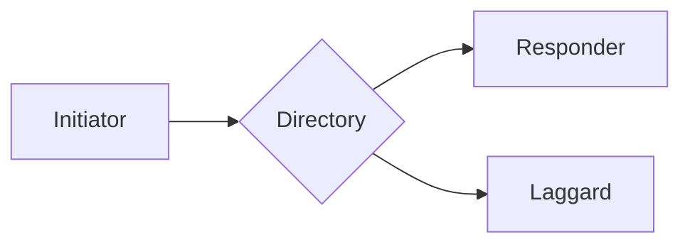
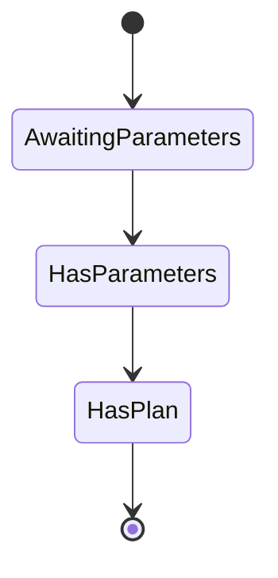
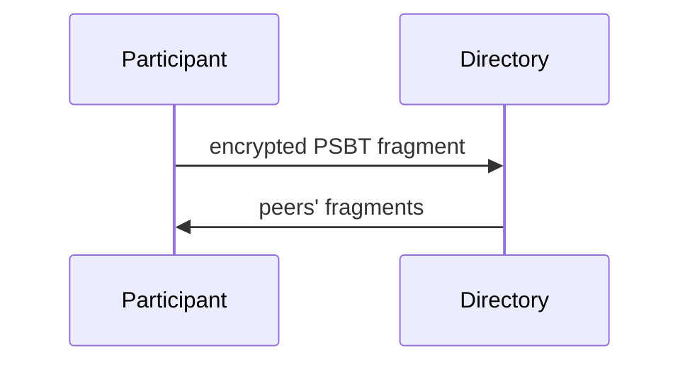
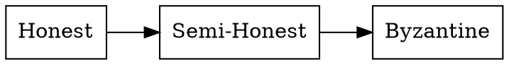

# Rendering test

## Graphviz (dependency.dot from #3)

```dot process
digraph dependency_graph {
    // No canvas fill: the page background shows through, light or dark.
    bgcolor="transparent";
    rankdir=TB;
    splines=polyline;
    compound=true;
    newrank=true;
    node [fontname=Helvetica, fontsize=12, shape=box];
    edge [fontname=Helvetica, fontsize=10, color="#8A8A8A", fontcolor="#8A8A8A"];

    // ── Node definitions ─────────────────────────────────────────────

    // Goals
    Fungibility [label="Fungibility", style=filled, fillcolor="#4A90D9", fontcolor=white];
    Privacy     [label="Privacy",     style=filled, fillcolor="#4A90D9", fontcolor=white];

    // Core
    CoinJoin [label="CoinJoin", style=filled, fillcolor="#E67E22", fontcolor=white, penwidth=2];

    // ── Trust-model encapsulation ────────────────────────────────────
    // BFT ⊇ Semi-Honest Protocol ⊇ Honest Protocol.
    // These are containers grouping top-level concepts, not dependency nodes.
    subgraph cluster_bft {
        label="BFT";
        style=rounded; color="#27AE60"; penwidth=2;
        fontname=Helvetica; fontsize=13; fontcolor="#27AE60";

        Market    [label="Market Based",          style=filled, fillcolor="#27AE60", fontcolor=white];
        Incentive [label="Incentive Compatible",  style=filled, fillcolor="#27AE60", fontcolor=white];

        subgraph cluster_semihonest {
            label="Semi-Honest Protocol\n(metadata privacy required)";
            style=rounded; color="#2AA5A5"; penwidth=2;
            fontname=Helvetica; fontsize=13; fontcolor="#2AA5A5";

            PrivacyPreservation [
                label="Privacy Preservation",
                style=filled, style=filled, fillcolor="#27AE60", fontcolor=white
            ];
            NetSettle [label="Net Settlement", style=filled, fillcolor="#27AE60", fontcolor=white];

            subgraph cluster_honest {
                label="Honest Protocol\n(trusting peers)";
                style=rounded; color="#C08A10"; penwidth=2;
                fontname=Helvetica; fontsize=13; fontcolor="#C08A10";

                Batching  [label="Arbitrary Batching", style=filled, fillcolor="#27AE60", fontcolor=white];
            }
        }
    }

    // Shared protocol components
    TxStateMachine [
        label="Tx Construction\nState Machine",
        fontcolor="#A97BD5", color="#A97BD5", penwidth=2
    ];

    // Specs and interfaces
    PSBTLattice [
        label="PSBT Lattice Spec",
        fontcolor="#A97BD5", color="#A97BD5",
        penwidth=2, style=dashed, shape=component
    ];
    P2PChannel [
        label="P2P Comms\nChannel",
        fontcolor="#A97BD5", color="#A97BD5",
        penwidth=2, style=dashed, shape=component
    ];
    MsgSetReplication [
        label="Message Set\nReplication",
        fontcolor="#A97BD5", color="#A97BD5",
        penwidth=2, style=dashed, shape=component
    ];

    // Payment flow interfaces (boxed together)
    subgraph cluster_payment_flow {
        label="Payment Flow";
        style=rounded; color="#A97BD5";
        fontname=Helvetica; fontsize=11; fontcolor="#A97BD5";
        { rank=same; PaymentInit; PaymentConfirm; }

        PaymentInit [
            label="Payment Initiation\nMessage",
            fontcolor="#A97BD5", color="#A97BD5",
            penwidth=2, style=dashed, shape=component
        ];
        PaymentConfirm [
            label="Payment Confirmation\nMessage",
            fontcolor="#A97BD5", color="#A97BD5",
            penwidth=2, style=dashed, shape=component
        ];
    }

    // Coalition Formation — concrete instantiation of Market Based
    CoalitionFormation [
        label="Coalition Formation",
        fontcolor="#27AE60", color="#27AE60", penwidth=2
    ];

    // Session Parameters — parameters negotiated in coalition formation
    SessionParameters [
        label="Session Parameters",
        fontcolor="#A97BD5", color="#A97BD5",
        penwidth=2, style=dashed, shape=component
    ];

    // Aggregator Role — role definition in coalition formation
    AggregatorRole [
        label="Aggregator Role",
        fontcolor="#A97BD5", color="#A97BD5",
        penwidth=2, style=dashed, shape=component
    ];

    // Orderbook Mechanism — abstract interface beneath Coalition Formation
    OrderbookMechanism [
        label="Orderbook Mechanism",
        fontcolor="#A97BD5", color="#A97BD5",
        penwidth=2, style=dashed, shape=component
    ];

    // BIP322 Ownership Proof — cryptographic proof mechanism for Orderbook
    BIP322OwnershipProof [
        label="BIP322 Ownership\nProof",
        fontcolor="#A97BD5", color="#A97BD5",
        penwidth=2, style=dashed, shape=component
    ];

    // Final Proposal — outcome of session parameters and aggregator role
    FinalProposal [
        label="Final Proposal",
        fontcolor="#A97BD5", color="#A97BD5",
        penwidth=2, style=dashed, shape=component
    ];

    // Cost Function — cost model for privacy preservation
    CostFunction [
        label="Cost Function",
        fontcolor="#A97BD5", color="#A97BD5",
        penwidth=2, style=dashed, shape=component
    ];

    // Objective Fees — objective function component of cost model
    ObjectiveFees [
        label="Objective Fees\n(e.g. fees)",
        fontcolor="#A97BD5", color="#A97BD5",
        penwidth=2, style=dashed, shape=component
    ];

    // Privacy Metrics — metrics for evaluating privacy preservation
    PrivacyMetrics [
        label="Privacy Metrics",
        fontcolor="#A97BD5", color="#A97BD5",
        penwidth=2, style=dashed, shape=component
    ];

    // Open Gossip — concrete implementation of Orderbook Mechanism
    OpenGossip [
        label="Open Gossip",
        color="#C08A10", fontcolor="#C08A10"
    ];

    // Listen Advertisements — listening mechanism for Open Gossip
    ListenAdvertisements [
        label="Listen Advertisements",
        fontcolor="#A97BD5", color="#A97BD5",
        penwidth=2, style=dashed, shape=component
    ];

    // Agreement — BFT agreement mechanism
    Agreement [
        label="Agreement",
        fontcolor="#A97BD5", color="#A97BD5",
        penwidth=2, style=dashed, shape=component
    ];

    // Validity Proofs — cryptographic proofs for BFT
    ValidityProofs [
        label="Validity Proofs",
        fontcolor="#A97BD5", color="#A97BD5",
        penwidth=2, style=dashed, shape=component
    ];

    // Leaf implementations (left→right per rank row): BIP77Dir, iroh, Nostr
    BIP77Dir [label="BIP77 Directory\n(OHTTP)", color="#2AA5A5", fontcolor="#2AA5A5"];
    Iroh     [label="iroh",                 color="#C08A10", fontcolor="#C08A10"];
    Nostr    [label="Nostr",                color="#C08A10", fontcolor="#C08A10"];

    // ── Layer constraints (second axis) ─────────────────────────────
    { rank=same; Fungibility; Privacy; }
    { rank=same; Agreement; ValidityProofs; CoalitionFormation; CostFunction; PaymentInit; PaymentConfirm; TxStateMachine; }
    { rank=same; OrderbookMechanism; AggregatorRole; SessionParameters; ObjectiveFees; PrivacyMetrics; P2PChannel; MsgSetReplication; PSBTLattice; }
    { rank=same; OpenGossip; BIP322OwnershipProof; FinalProposal; Iroh; Nostr; BIP77Dir; }

    // ── Real edges (grouped by source; ordered left→right per rank rows) ──

    // Goals → Core
    Fungibility -> CoinJoin;
    Privacy     -> CoinJoin;

    // CoinJoin → BFT children (Market, Incentive, PrivacyPreservation, NetSettle, Batching)
    CoinJoin -> Market;
    CoinJoin -> Incentive;
    CoinJoin -> PrivacyPreservation;
    CoinJoin -> NetSettle;
    CoinJoin -> Batching;

    // BFT children → { CoalitionFormation, CostFunction, Payment Flow, TxStateMachine } (+ Agreement/ValidityProofs)
    Market    -> CoalitionFormation;
    Market    -> Agreement;
    Market    -> ValidityProofs;
    Incentive -> CoalitionFormation;
    Incentive -> Agreement;
    Incentive -> ValidityProofs;
    PrivacyPreservation -> CostFunction;
    NetSettle -> PaymentInit [lhead=cluster_payment_flow];
    NetSettle -> TxStateMachine;
    Batching  -> TxStateMachine;

    // { CoalitionFormation, CostFunction, Payment Flow, TxStateMachine } → specs/interfaces row
    CoalitionFormation -> SessionParameters;
    CoalitionFormation -> AggregatorRole;
    CoalitionFormation -> OrderbookMechanism;
    CostFunction -> ObjectiveFees;
    CostFunction -> PrivacyMetrics;
    PaymentInit    -> P2PChannel;
    PaymentConfirm -> P2PChannel;
    TxStateMachine -> P2PChannel;
    TxStateMachine -> MsgSetReplication [label="practically", style=dashed];
    TxStateMachine -> PSBTLattice       [label="by definition"];

    // specs/interfaces row → leaves (BIP77Dir, iroh, Nostr, …)
    SessionParameters  -> FinalProposal;
    AggregatorRole     -> FinalProposal;
    OrderbookMechanism -> BIP322OwnershipProof;
    OrderbookMechanism -> OpenGossip;
    P2PChannel        -> Iroh;
    P2PChannel        -> Nostr;
    MsgSetReplication -> BIP77Dir [label="OHTTP metadata privacy"];
    MsgSetReplication -> Iroh;
    MsgSetReplication -> Nostr;

    // leaves → terminal
    OpenGossip -> ListenAdvertisements;

    // Fix bottom leaf-rank left→right order (per line 190) so the middle nodes follow
    OpenGossip -> BIP322OwnershipProof -> FinalProposal -> ObjectiveFees ->
        PrivacyMetrics -> Iroh -> Nostr -> BIP77Dir [style=invis];

    // Fix specs/interfaces-rank left→right order (per line 189)
    Agreement -> ValidityProofs -> OrderbookMechanism -> AggregatorRole ->
        SessionParameters -> P2PChannel -> MsgSetReplication -> PSBTLattice [style=invis];
}
```

## Mermaid: flowchart

## Mermaid: state diagram

## Mermaid: sequence diagram

## Graphviz: uncoloured graph

## KaTeX

The ambiguity of an output set $E$ is bounded below by the number of subset
sum solutions $W(E)$:

$$
W(E) = \#\{ S \subseteq \mathcal{U} : \textstyle\sum_{u \in S} v(u) = E \}
$$

## Footnotes

Github flavoured footnotes render without a preprocessor.[^trust]

[^trust]: Trust never means giving up control over one's funds, by virtue of
unanimous consent.
